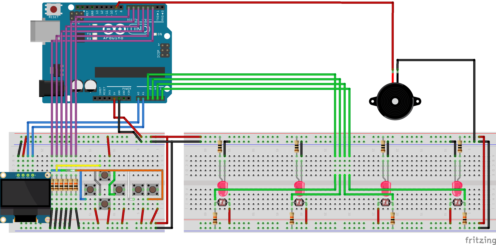

# Lector de monedas con arduino (version láser)

## Documentación necesaria para la interconexión de la electrónica.
Para esta versión, es necesario el uso de fotoresistencias y de diodos láser para el correcto
funcionamiento.
Los diodos tienen la función de estar dando una fuete de luz constante al fotoresistor para que
cuando pase un cierto objeto, este corte la luz al fotoresistor y se detecte que una moneda fue
ingresada en la máquina.

### Lista de materiales:
* 1 arduino uno.
* 1 display OLED 128x64.
* 4 diodos LED láser de 5v a 1mA.
* 4 fotoresistencias.
* 4 resistencias de 10 ohms.
* 6 resistencias de 10 kilo ohms.
* 6 push buttons de 2 patas.
* 1 Beeper.
* 1 Breadboard 830 puntos.
* 1 Breadboard 400 puntos.
* 17 cables dupont macho a macho de 20cm.
* Alambre de cobre aislado calibre 26 (lo necesario)

### Interconexiones hacia arduino.
* ***Pin digital 2:*** Botón axión izquierda.
* ***Pin digital 3:*** Botón axión arriba.
* ***Pin digital 4:*** Botón axión derecha.
* ***Pin digital 5:*** Botón axión abajo.
* ***Pin digital 6:*** Botón axión entrar.
* ***Pin digital 7:*** Botón axión opciones.
* ***Pin digital 9 (PWM):*** Buzzer.
* ***Pin análogo 0:*** SCL Pantalla OLED 128x64.
* ***Pin análogo 1:*** SDA Pantalla OLED 128x64.
* ***Pin análogo 2:*** Fotoresistor para $1.00 MXN.
* ***Pin análogo 3:*** Fotoresistor para $2.00 MXN.
* ***Pin análogo 4:*** Fotoresistor para $5.00 MXN.
* ***Pin análogo 5:*** Fotoresistor para $10.00 MXN.

### Esquemático de conexiones.
